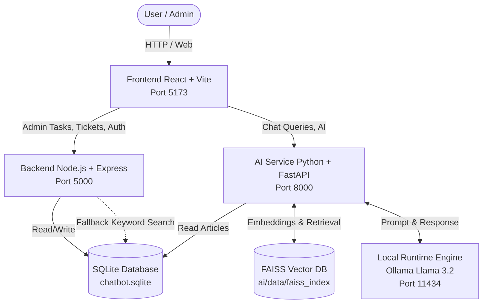

# System Architecture & Working Flow
## L0 Support Chatbot & Knowledge Base System

This document provides a comprehensive overview of the system architecture, the responsibilities of each microservice, and the step-by-step data flows that power the application.

---

## 🏗️ 1. High-Level Architecture

The system is built using a **local-first microservices architecture**. This ensures strong data privacy, zero cloud API costs, and high reliability through fallback mechanisms.

---

## 🧩 2. Component Responsibilities

### 💻 Frontend (`/frontend`)
* **Stack**: React, Vite, Tailwind CSS
* **Role**: The user interface. It handles the chatbot conversational UI for end-users, and the admin dashboard for managing tickets, viewing analytics, and uploading Knowledge Base (KB) articles.

### ⚙️ Backend (`/backend`)
* **Stack**: Node.js, Express.js
* **Role**: The traditional web server.
  - Manages JWT Authentication and User Roles.
  - Provides CRUD APIs for Support Tickets and KB Articles.
  - Acts as a **Fallback Search Engine**. If the AI service is offline, the backend queries the SQLite database using exact keyword matching to keep the bot alive.

### 🧠 AI Service (`/ai`)
* **Stack**: Python, FastAPI, FAISS
* **Role**: The core AI logic and Retrieval-Augmented Generation (RAG) engine.
  - Connects to SQLite to fetch KB articles and vectorize them.
  - Runs the **ReAct Agent Loop** to determine if it can confidently answer a user's question or if it should escalate to a human.
  - Exposes an **MCP (Model Context Protocol)** server for tool execution.

### 🗄️ Database (`chatbot.sqlite`)
* **Stack**: SQLite
* **Role**: The single source of truth for text data. Stores Users, Roles, Support Tickets, Chat Histories, and the raw text of the Knowledge Base articles.

### 🤖 Local Runtime Engine
* **Stack**: Ollama (Llama 3.2, nomic-embed-text)
* **Role**: Runs completely locally. It generates the mathematical vectors (embeddings) for FAISS and generates the final natural language text for the chatbot.

---

## 🔄 3. Core Working Flows

### Flow A: The Setup & Sync Flow (Startup)
When the AI Service starts, it must prepare its memory:
1. `uvicorn` starts the FastAPI server.
2. The `startup_event` triggers `db_sync.py`.
3. The service connects to `chatbot.sqlite` and fetches all KB articles.
4. It sends the text to Ollama (`nomic-embed-text`) to generate vectors.
5. The vectors are saved to the local disk in the `ai/data/faiss_index` folder.

### Flow B: The RAG Chat Flow (Happy Path)
When a user asks a question:
1. **User** types a question in the React **Frontend**.
2. Frontend sends the query to the **AI Service** (`/api/agent/query`).
3. AI Service vectorizes the question via Ollama.
4. AI Service searches the **FAISS Vector DB** for the closest matching document vectors (Cosine Similarity).
5. AI Service retrieves the raw text of the matching documents.
6. The Agent loop constructs a strict prompt with the retrieved text and sends it to **Llama 3.2**.
7. Llama 3.2 generates an answer, citations, and a confidence score.
8. If the confidence is **>= 30%**, the answer is returned to the user.

### Flow C: The Escalation Flow (Low Confidence)
When the AI does not know the answer:
1. Steps 1-7 of Flow B occur.
2. The AI calculates a confidence score **< 30%** (or finds zero relevant documents).
3. The AI Agent refuses to answer to prevent hallucination.
4. The AI triggers the **Ticket Management API** on the Node.js backend to create a support ticket.
5. The user is notified that their issue has been escalated to a human agent.

### Flow D: The Fallback Flow (AI Offline)
If the Python AI service crashes or Ollama is offline:
1. User types a question in the **Frontend**.
2. Frontend attempts to reach the AI Service but fails (Timeout/500 Error).
3. Frontend automatically reroutes the query to the **Node.js Backend**.
4. The Backend performs a standard `LIKE %keyword%` SQL query on the `chatbot.sqlite` database.
5. The Backend returns the closest matching articles directly to the user, ensuring the self-service portal remains functional.
