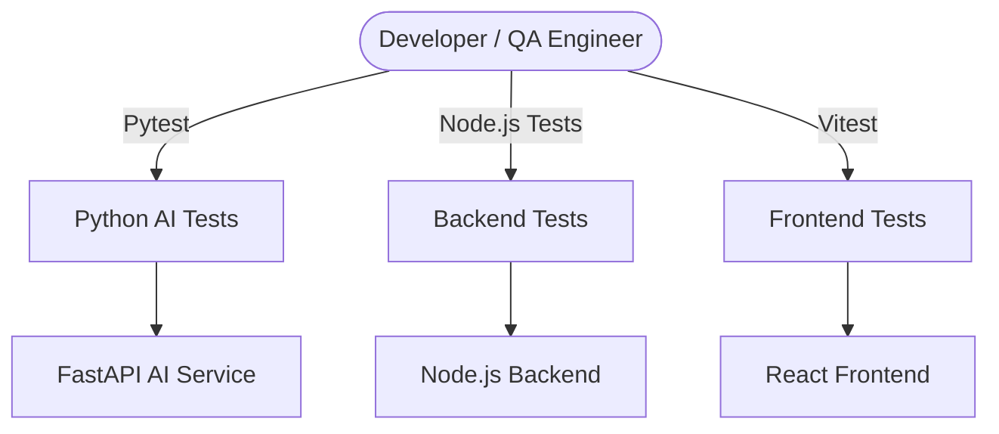

# 🧪 Testing Architecture & Validation Flow
## L0 Support Chatbot & Knowledge Base System

This document provides an overview of the automated testing strategy used to validate the AI engine, backend fallback mechanisms, and frontend user interface.

---

# 🏗️ 1. High-Level Testing Architecture



---

# 🧩 2. Testing Components

### 🧠 Python AI Tests
**Framework:** Pytest

Validates:
- Levenshtein distance calculations
- Typo correction logic
- Typo tolerance thresholds
- Query processing accuracy

**Command**

```bash
python -m pytest testing
```

---

### ⚙️ Backend Fallback Tests
**Framework:** Node.js

Validates:
- Title relevance boosting
- Keyword ranking
- Exact title matching
- Stopword filtering
- Search result ordering

**Command**

```bash
node testing/test_backend_happy_path.js
```

---

### 💻 Frontend Tests
**Framework:** Vitest

Validates:
- Priority styling
- Status styling
- Repository integration
- Component behavior using mocks

**Command**

```bash
cd frontend
npx vitest run --root=../ testing
```

---

# 🔄 3. Testing Flow

### Flow A: AI Validation
1. Run Pytest.
2. Validate typo detection and correction.
3. Verify query processing logic.
4. Generate test results.

### Flow B: Backend Validation
1. Run backend test script.
2. Execute fallback search tests.
3. Validate ranking and relevance scoring.
4. Generate test results.

### Flow C: Frontend Validation
1. Run Vitest.
2. Load React components.
3. Validate UI styles and behaviors.
4. Generate test results.

---

# ▶️ 4. Run Complete Test Suite

```bash
python -m pytest testing; node testing/test_backend_happy_path.js; cd frontend; npx vitest run --root=../ testing
```

---

# ✅ 5. Benefits of Testing

- Prevents regressions
- Ensures AI accuracy
- Maintains fallback reliability
- Improves user experience
- Supports production readiness

---


# 📌 Conclusion

The testing strategy covers:

1. AI Query Processing Layer (Pytest)
2. Backend Fallback Search Layer (Node.js)
3. Frontend User Interface Layer (Vitest)

Together, these tests ensure reliability, accuracy, and stability across the entire application.